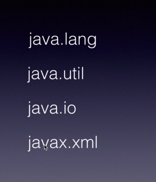

In Java, a package is a way to organize related classes and interfaces. A fully qualified name in Java includes the package name along with the class name. For example, java.util.ArrayList is the fully qualified name of the ArrayList class in the java.util package.

When using a class from another package in your code, you can either use the fully qualified name every time you reference the class, or you can import the class into your code. Importing a class allows you to use its simple name (without the package name) throughout your code.

Here's an example of using the fully qualified name to create an instance of the ArrayList class:
```
java.util.ArrayList<String> myList = new java.util.ArrayList<>();
```
```
import java.util.ArrayList;

// ...

ArrayList<String> myList = new ArrayList<>();
```


**The java.lang package is automatically available in all Java classes, as it contains fundamental classes and interfaces that are essential to the Java language. Some examples of classes in the java.lang package include Object, String, and Throwable.**


>>System.out.println()

1. System: This is the name of the class that contains the out field.
2. out: This is a static field of the System class that represents the standard output stream.
3. println(): This is a method of the PrintStream class (which is what the out field points to) that prints a line of text to the standard output stream and then terminates the line.