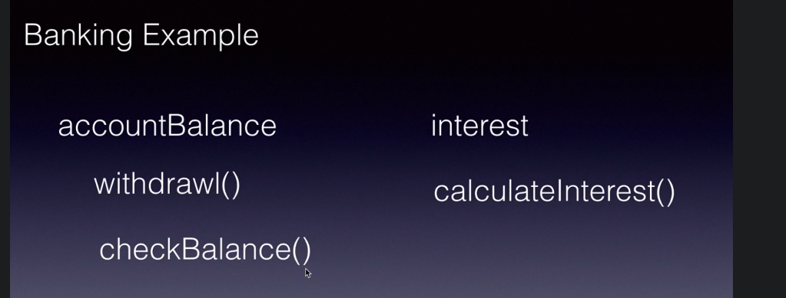

here in this example:-
intreset and calculate intrest are static methods 
because it same for every customer byt we can make
withdrawl and checkbalance methods() and accountbalance variable
as non static 

>>static block

static block we use when we want to run that before
running main method,it run when class is load

**if we have multiple blocks then it run in the order from up to down**

>>static methods

we can static methods inside from main method and 
static block,we need to use class name to call it

>>static variables

