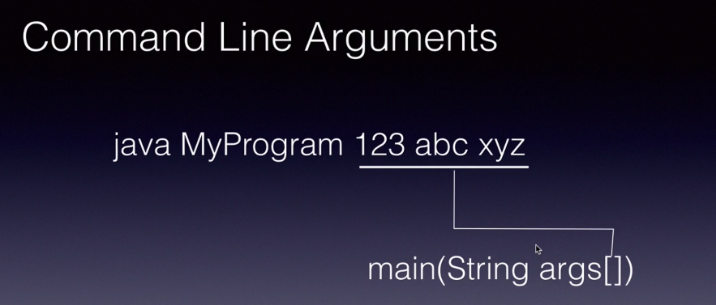

here in this example:-
intreset and calculate intrest are static methods 
because it same for every customer byt we can make
withdrawl and checkbalance methods() and accountbalance variable
as non static 

>>static block

static block we use when we want to run that before
running main method,it run when class is load


**if we have multiple blocks then it run in the order from up to down**

>>static methods


we can static methods inside from main method and 
static block,we need to use class name to call it

>>static variables


static variables loaded in the memory with the time of loading class

**NOTE->A static variable in Java exists for the entire duration of the program, from the time it is initialized to the time the program terminates.It is important to note that a static variable can be accessed even before an object of the class is created, as it belongs to the class and not to any particular instance of the class.**

**NOTE->In Java, global static variables are stored in the static memory area. The static memory area is a region of memory used to store class-level data, including static variables and static methods.
Static variables are initialized when the class is loaded into memory, and their memory is allocated in the static memory area**
```
valueOf(): Returns an Integer object that represents the specified int value.
toString(): Returns a String object representing the value of the Integer object.
intValue(): Returns the value of the Integer object as a primitive int.
parseInt(): Parses the string argument as a signed decimal integer and returns the corresponding int value.
myArray.length: myArray.length is a Java expression that returns the number of elements in an array called myArray.
```
