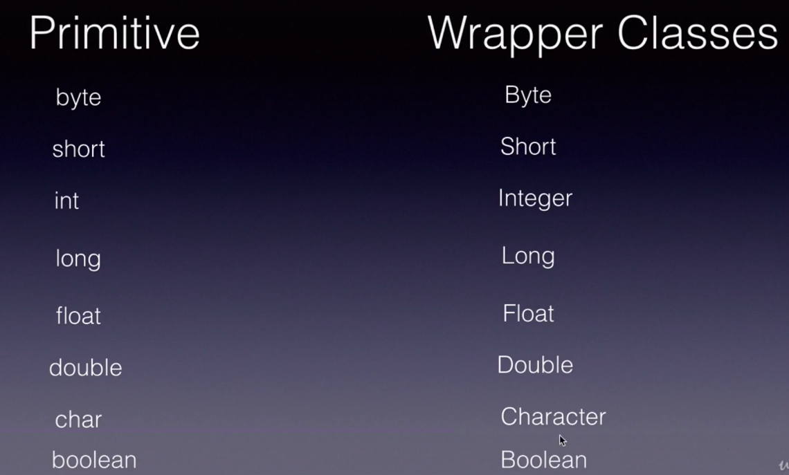
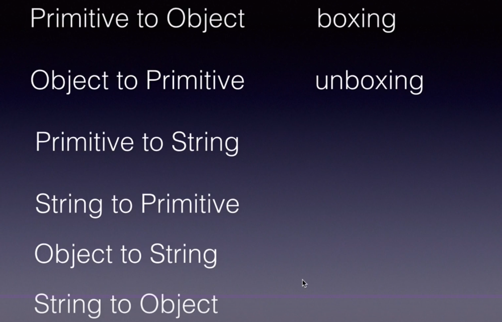

>>wapper class

Wrapper classes in Java are used to convert primitive data types into objects and vice versa. They provide a way to treat primitive data types as objects, which is useful in situations where objects are required, such as in collections, serialization, and reflection.