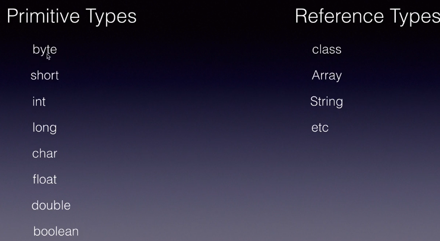
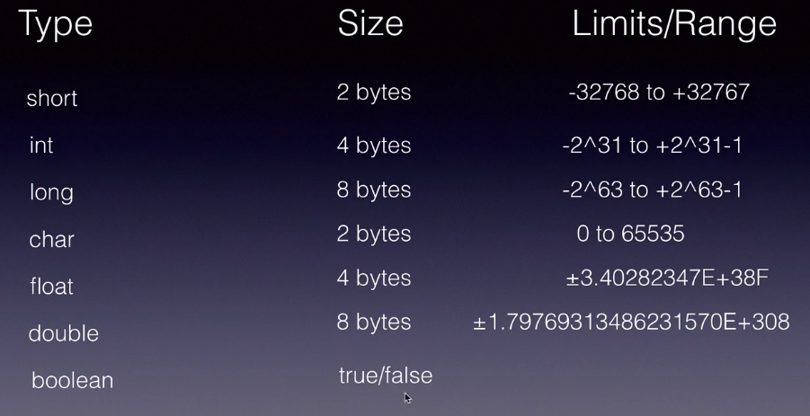

### Type casting

Type casting in Java refers to the process of converting one data type to another. There are two types of type casting: implicit and explicit.

>>Implicit type casting

also known as automatic type conversion, is when the compiler automatically converts one data type to another. This is done when the data types are compatible and no data loss will occur. For example, converting an int to a double.

>>explict type casting

Explicit type casting, also known as manual type conversion, is when the programmer explicitly converts one data type to another using casting operators