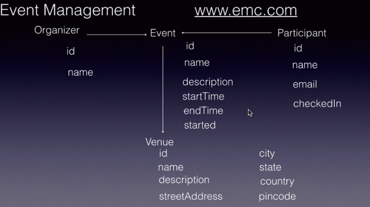

>>Constructor

1.if a class does not have any explicit constructor defined, the Java compiler will automatically generate a default constructor for the class. This default constructor is provided by the JVM and is parameterless (i.e., it takes no arguments).

2.If you define a parameterized constructor in your class, the Java compiler will not generate a default constructor automatically. As a result, if you want your class to have a default constructor as well, you will need to define it explicitly in your code.