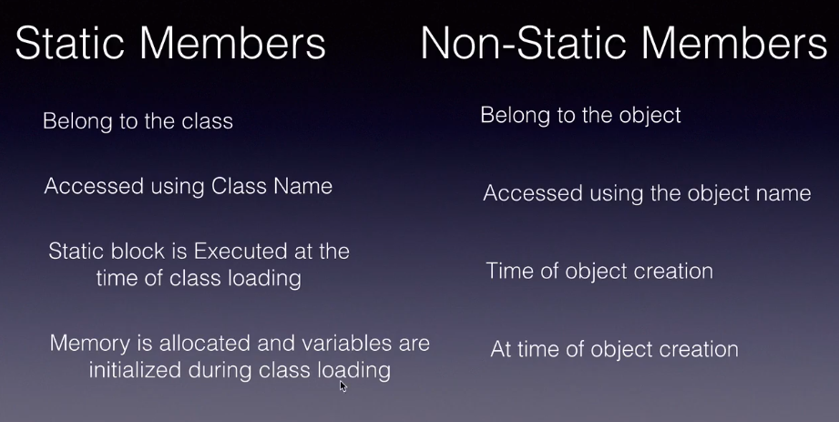
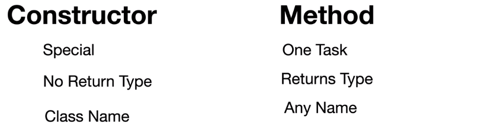

## Non static members

all theses non static mebers like
non static variable
constrctor,non static methods,non static block
are specific to an object

>>non static block

non static block run before the constructor is called
 
**NOTE->non static block called every time when object is crteated and non static called only once**

**NOTE->if we didnt create a defualt counstructor then jvm will create the default cons. by itself**

>>This keyword

The 'this' keyword refers to the current instance of the class in which it is used.

